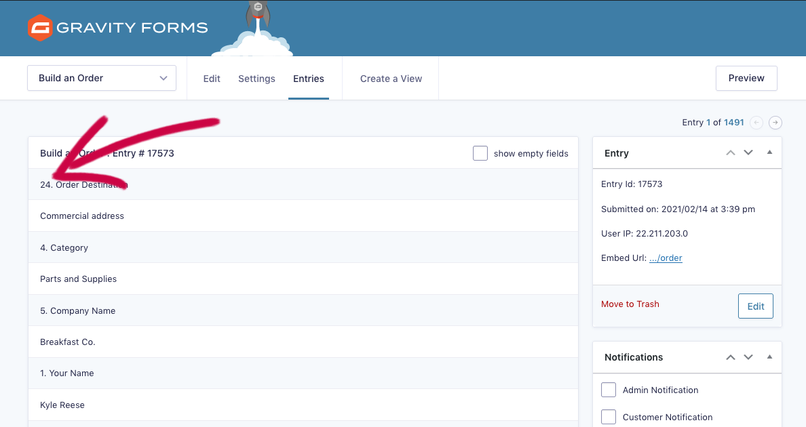
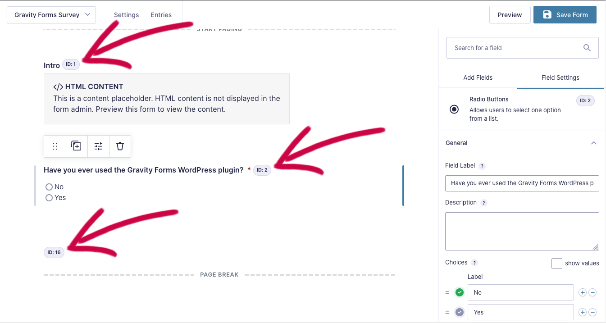
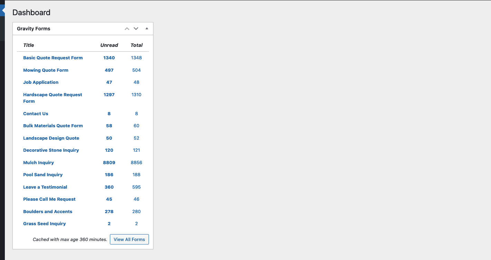

#  Power Boost for Gravity Forms

WordPress plugin. An add-on for Gravity Forms. Enhances Gravity Forms for power users.

Visit this plugin on wordpress.org: [wordpress.org/plugins/power-boost-for-gravity-forms](https://wordpress.org/plugins/power-boost-for-gravity-forms/)

Visit this plugin's home page: [breakfastco.xyz/power-boost-for-gravity-forms](https://breakfastco.xyz/power-boost-for-gravity-forms/)

## FEATURES


### Adds a "Last Entry" column to the forms list.

Indicates which forms are truly active   


### Adds a tab "Replace Forms" to the Import/Export page

Updates existing forms instead of creating duplicates

   


### Adds a "Resend Feeds" button near the Resend Notifications button


### Saves .json file exports of each form when forms are edited

Saved in `wp-content/uploads/gf-json/`. Override this path with the `gravityforms_local_json_save_path` hook.

   


### Adds field IDs near labels when viewing or editing an entry in the dashboard

   


### Adds field IDs near labels when editing forms

Thanks be to Dario Nem for suggesting this snippet from the Gravity Wiz toolbox.




### Adds a "Copy Shortcode" row action link to the forms list


### Enables merge tags in HTML fields

Requires page breaks. Merge tags display user input from previous pages in HTML fields.

Enables merge tags in HTML fields. The merge tag must be on a page after the field. If your field, “What kind of pet do you have?” is on page one of the form, the HTML field containing the merge tag `{What kind of pet do you have?:1}` should be on page two or any page after one.


### Caches the Dashboard Widget

Replaces the Gravity Forms dashboard widget with a copy that caches the results of the three database queries. These queries can take a handful of seconds to run on sites with hundreds of forms and tens of thousands of entries.




## FILTER HOOKS

### Change the Local JSON Path

`gravityforms_local_json_save_path`

The absolute file path to a directory where the form export .json files are saved. Defaults to `wp-content/uploads/gf-json`

#### Example
 
Changes the path to save .json files to one level above the directory containing WordPress.

```
<?php
add_filter( 'gravityforms_local_json_save_path', 'power_boost_change_json_path' );
/**
 * Changes the path to save .json files to one level above the directory containing WordPress.
 *
 * @return string
 */
function power_boost_change_json_path() {
	return dirname( ABSPATH );
}

```

&nbsp;

### Edit Form Before it's Saved as JSON

`gravityforms_local_json_save_form`

Allows a forms array containing a single form to be edited just before it is written to the .json file

&nbsp;

### Toggle JSON Pretty Print

`gravityforms_local_json_minimize`

Controls whether the form JSON is encoded with the `JSON_PRETTY_PRINT` flag. Defaults to `false`

&nbsp;

### Change Dashboard Widget Cache Time

`gravityforms_dashboard_cache_duration`

The number of seconds to cache the Gravity Forms dashboard widget database queries. Defaults to `6 * HOURS_IN_SECONDS`

&nbsp;

## MORE PLUGINS

[Power Boost for ACF](https://github.com/csalzano/power-boost-acf)
[Embed PDF for Gravity Forms](https://wordpress.org/plugins/embed-pdf-gravityforms/)